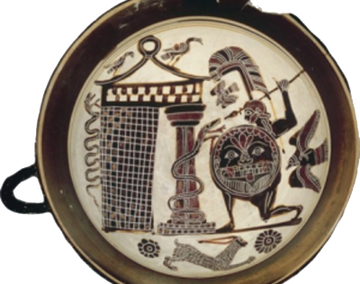

👉 [Cadmus Presentation Site](https://cadmus.fusi-soft.com): refer to this site for a general introduction to Cadmus. The site is still under development, especially for its interactive resources, but it still represents the most complete introduction to the system philosophy.

⚙️ [Cadmus Source Code](https://github.com/vedph/): the full source code of Cadmus is found in several VeDPH GitHub repositories. Some of the repositories implement the general infrastructure, while others are versions specialized for each real-world project using Cadmus.

## Cadmus

Cadmus is an open-ended, modular, and full-stack creation system for highly structured content, including text with any number of specialized annotation layers, and capable of multiple types of data export (including TEI) and import (mostly via the [Proteus](proteus.md) system).

- 🛠️ [developer's guide](cadmus/dev/toc.md)
- 🌐 [hosting Cadmus](cadmus/hosting.md)
  - [installing Docker](cadmus/docker-setup.md)
  - [configuring HTTPS](cadmus/https.md)
- 🧑‍🤝‍🧑 [projects using Cadmus](cadmus/projects.md)
- 🕸️ [Cadmus graph demo](https://cadmus-graph-demo.fusi-soft.com)
- 🧱 [Cadmus bricks demo](https://cadmus-bricks.fusi-soft.com)

Cadmus presentation speech at [VeDPH](https://www.unive.it/pag/39287) seminars:

<iframe width="560" height="315" src="https://www.youtube.com/embed/lYykjz26TCg" title="Daniele Fusi, Presenting Cadmus: a general-purpose and modular content editing alternative" frameborder="0" allow="accelerometer; autoplay; clipboard-write; encrypted-media; gyroscope; picture-in-picture" allowfullscreen></iframe>
