- [Walker](#walker)
- [Sample](#sample)
  - [GraphWalker](#graphwalker)
    - [Properties](#properties)
    - [Methods](#methods)
- [API](#api)
  - [API - Nodes](#api---nodes)
  - [API - Triples](#api---triples)
  - [API - Walker](#api---walker)

## Walker

The walker is used to traverse the graph by exploring the connections of an arbitrarily chosen starting node in it. Its UI provides an easy way of getting to the desired node, while also visualizing the connections of a specific node.

As the graph may quickly grow up in size, it would be impractical to represent all the nodes and their links (edges) at once; the graph would be barely readable, overcrowded by a high number of overlapping shapes and lines. The solution adopted in the editor, where users may want to explore the relations starting from an object towards any other object, is displaying nodes and edges as you walk across the graph. Also, all the edges of the same type are initially grouped under a single graphical element (a _properties group_).

So, you start from a single node, and just see all its "outbound" (i.e. where this node is the subject) and "inbound" (i.e. where this node is the object) links, grouped by type, with their counts. For instance, if the node has 4 labels in 4 different languages, you won't see 4 links, but just a node representing their group. When you double click it, it will expand into those 4 links, each leading to another node. In the same way, you will be able to walk along all the links, from node to node, progressively unveiling the graph.

Additionally, a number of _filters_ are available to be freely combined, so that you see only those links or nodes you are interested in. These filters vary according to the node selected while walking, and each node retains its own filtering state.

## Sample

The video below shows a sample walk session:

<iframe width="560" height="315" src="https://www.youtube.com/embed/P0TlqbOi590" title="YouTube video player" frameborder="0" allow="accelerometer; autoplay; clipboard-write; encrypted-media; gyroscope; picture-in-picture; web-share" allowfullscreen></iframe>

This demo relies on a mock dataset, whose nodes are listed in this picture:

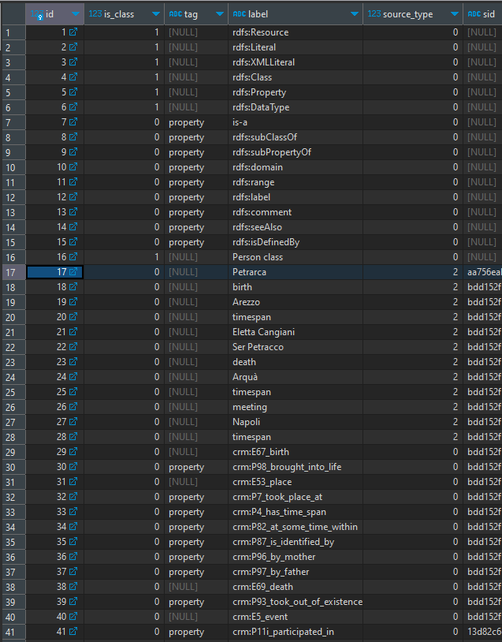

In the video, we start walking from Petrarch node, whose ID is 17 in this table. Note that this node also has a [SID](graph-mappings.md#source-id-sid), because it was derived from mapping a Cadmus part. You can also see that a number of nodes represent predicates, and are thus tagged with `property`; while other nodes represent classes (`is_class`=1). Typically, predicates are injected in the graph at an earlier stage, and are used by mapping rules.

The nodes can then be used as the building blocks of triples:

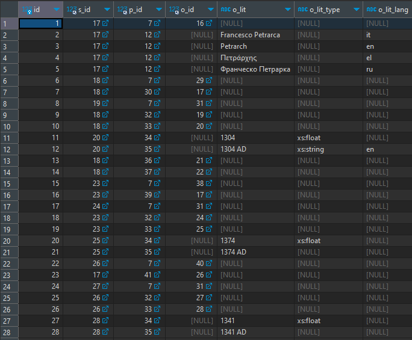

As every node is identified by a numeric ID, and also predicates are represented here as nodes, a triple is just linking three different numeric IDs for subject (`s_id`), predicate (`p_id`), and object (`o_id`), unless the object is a literal, with its value and metadata like data type and language (`o_lit`, `o_lit_type`, `o_lit_lang`).

For instance, the first row having 17 (=`Petrarch`), 7 (`is-a`), and 16 (`Person class`) says that Petrarch is a person.

(1) If we start our walk from Petrarch, at first we get this graph:

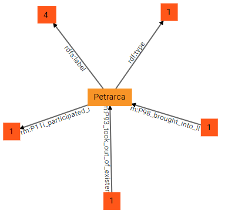

Here the central node, Petrarch, is the origin; 3 groups of predicates start from it (outbound nodes), while 2 end into it (inbound nodes). In other terms, Petrarch is the subject of a number of triples having as predicates `rdf:type`, `rdfs:label`, and `crm:P11i_participated_in`; the numbers in the squares representing these groups of predicates tell how many triples are inside each group. This is much more compact than directly visualizing all the connections to other nodes stemming from Petrarch. Additionally, Petrarch is also the object of 2 other groups of predicates, `crm:P98_brought_into_life` and `crm:P93_took_out_of_existence`: it is easy to predict that their subjects will be a birth and a death event, respectively.

(2) we can now start exploring the graph in any direction. By double clicking node 4 from `rdfs:label` we get 4 literal nodes, each representing a literal value for a label in a given language. These are the labels attached to the Petrarch node (for Italian, Russian, Greek, and English).

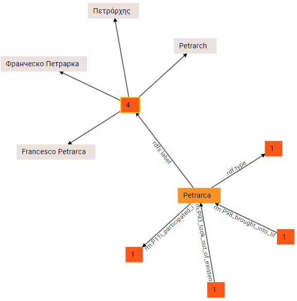

>As you can see, literal nodes are gray.

Of course, literal nodes are terminal nodes, so no longer expansion is possible here. Also, note that each single node in the walker mantains a filters and paging data, so that at any time and from any node you can narrow the visualization to focus on what you are looking for. For instance, here we just have 4 languages: but it might happen that our node has dozens of different languages. Instead of visualizing all of them at once, the property group node shows a virtual "page" at a time; further, you can filter out all the unwanted nodes which might clutter the visualization. So, we might want to see only English labels; this is done by applying a filter at the level of the current node (square 4 from `rdfs:label`). Next to the graph the walker shows a number of tools, mostly including filters, which vary according to the selected node. In this case, we are applying a language filter in the group of literal filters, so that we see only English (`en`):

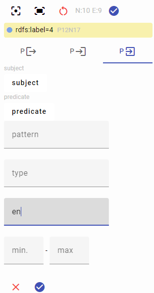

The result is now filtered to include only the English label:

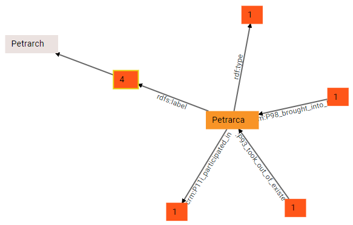

(3) With just 4 languages this is not that useful, but it might be handy when dealing with a lot of them. Meanwhile, we remove the filter to get all the languages back, and continue walking. This time we expand the group from `rdf:type`, and we get to a `Person class node`. This visually reflects the triple with ID 1 we explained above:

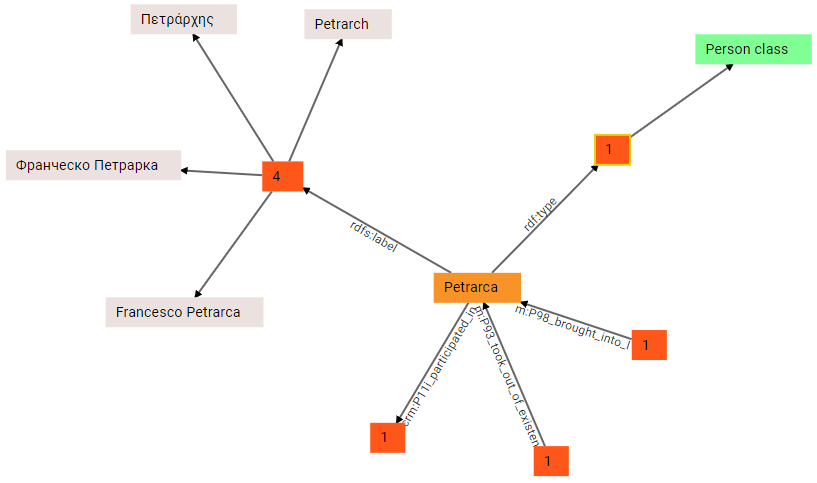

(4) Again, we can expand the last outbound group, `crm:P11i_participated_in`, and we find a meeting node:

(5) We can now start expanding the inbound groups: `crm:P98_brought_into_life` takes us to the subject of this triple (whose object is Petrarch), a birth event:

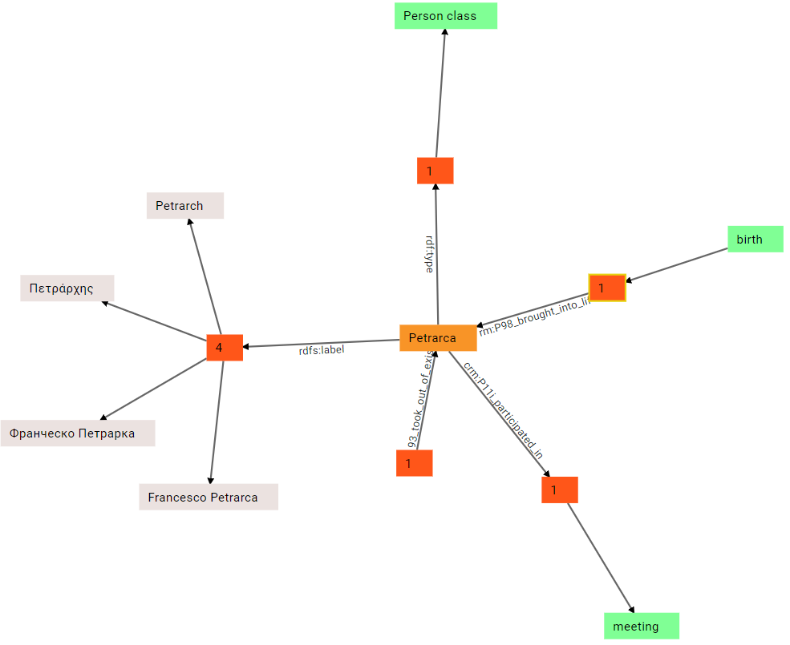

(6) Similarly, we can expand the other inbound group, for death:

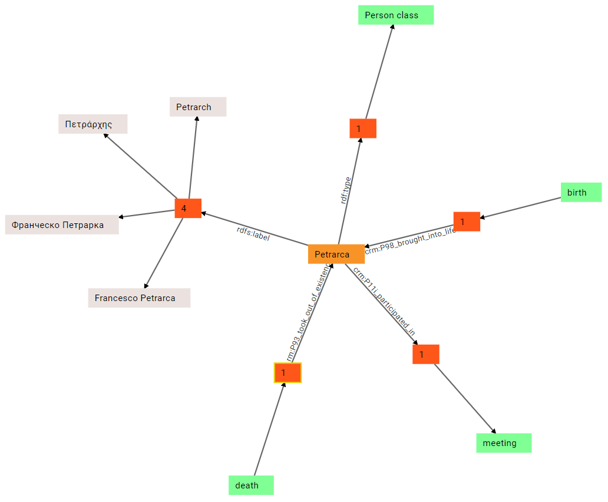

(7) There is no limit to expansion. We can continue by expanding the birth node. In this case, we get a number of outbound links: one of them already existed, and connected Petrarch to his birth; but the birth node has other outbound property groups: `crm:P96_by_mother`, `crm:P97_by_father`, `crm:P7_took_place_at`, and `crm:P4_has_time_span`. As you can guess, these links are going to specify Petrarch's mother and father, and his place and date of birth:

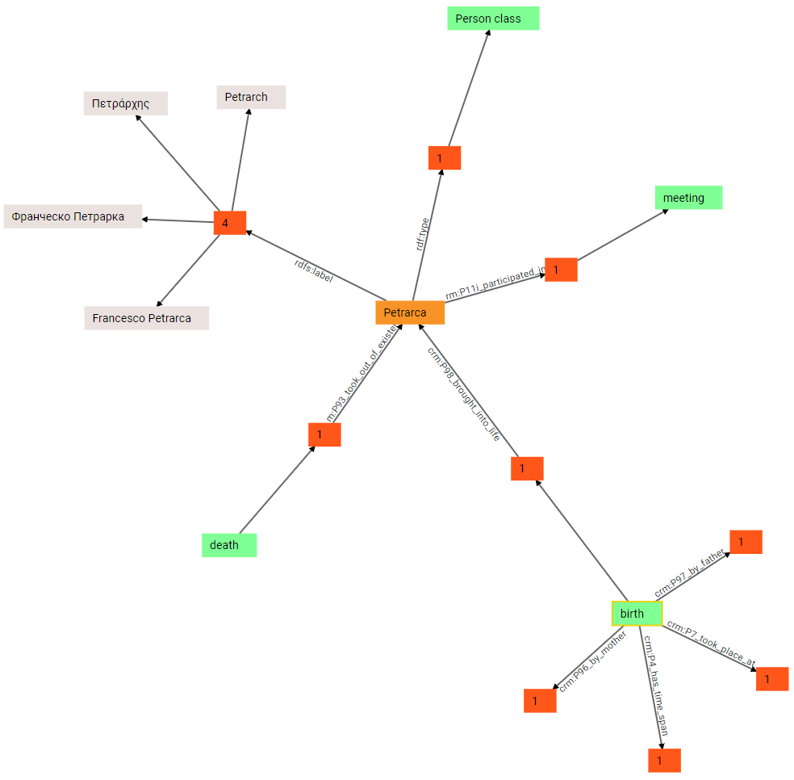

(8) We can now expand all these groups, to see the objects of each corresponding triple: so, the object of by-mother predicate is Eletta Cangiani; the object of by-father predicate is Ser Petracco; the object of took-place-at predicate is Arezzo; and the object of has-timespan is a time span:

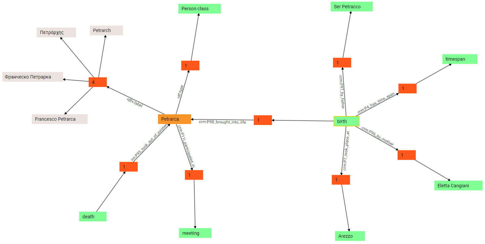

(9) In turn, the timespan can be further expanded: we thus discover that it's the subject of two triples, one with predicate `crm:P82_at_some_time_within`, and another with predicate `crm:P87_is_identified_by`. This is because the timespan has a numeric value (expressed with P82) and a text value representing it (expressed with P87). This derives from mapping the Cadmus historical date model.

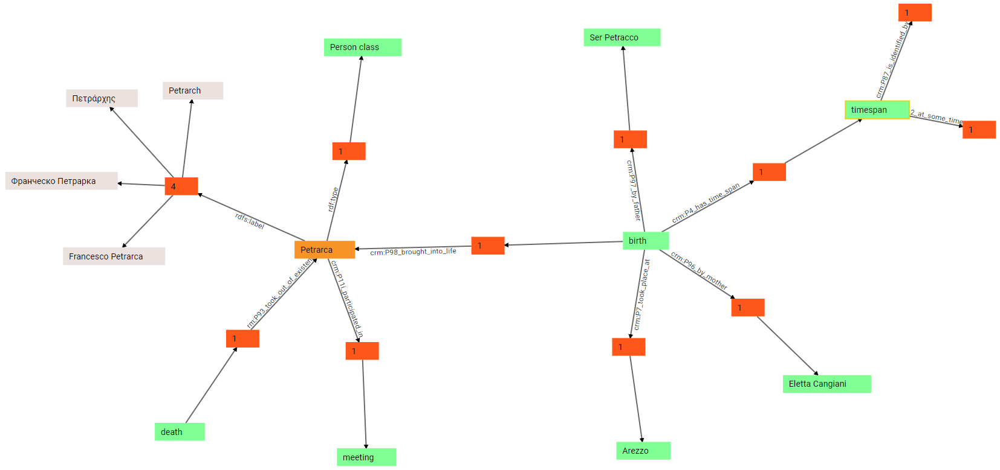

(10) In fact, if we further expand these predicates we end up with two literal values: a numeric value, `1304`, and a string value, `1304 AD`:

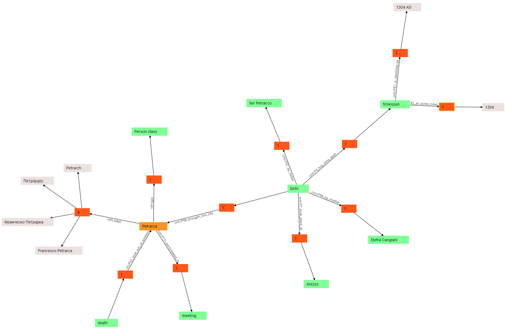

The process might continue indefinitely, but that's enough to show how the walker can be used in the context of a Cadmus-generated graph. We have started walking from a single node, and expanded all its connections up to other nodes of the graph, visually unveiling the data shown in the above tables. At any time, full filtering and pagins is available for each single node of the graph.

Typically, the walker is used to explore the graph and locate the node to edit, or see how all the nodes either created by projection or manually added get composed in the bigger picture.

### GraphWalker

The `GraphWalkerComponent` gets a single node ID (`nodeId`) representing the starting node, and can emit `nodePick` events when the user picks any of the displayed nodes. This component is just a wrapper of the `GraphWalker` class, which mantains a collection of nodes and a collection of edges. In turn, this class uses the `GraphService` to communicate with the [graph API backend](#api).

#### Properties

The parameters of the `GraphWalker` class are:

- `pageSize`: the paging size.
- `maxLiteralLen`: the max length of the literal value to display.

The class exposes a number of observables:

- `nodes$`: nodes.
- `edges$`: edges.
- `loading$`: true when loading data.
- `error$`: last error if any.
- `selectedNode$`: the currently selected node (a `GraphNode`, whose data property is any of the `WalkerData` types).
- `pOutFilter$`: the outbound linked nodes filter for the currently selected P node.
- `pInFilter$`: the inbound linked nodes filter for the currently selected P node.
- `pLitFilter$`: the literal linked nodes filter for the selected P node.
- `nOutFilter$`: the outbound triples filter for the currently selected N node.
- `nInFilter$`: the inbound triples filter for the currently selected N node.
- `childTotals$`: the total items fetched for each filter of the currently selected node. This is an object with a property for each total.

Nodes in the walker may represent nodes, literals, or property groups. While each node in the backend has a numeric ID, the nodes displayed in the walker get a calculated ID used inside it; the same happens for edges. These IDs are defined by the following conventions:

- **nodes**: `N<node_id>`, e.g. `N12` where `12` is the node's numeric ID.
- **literals**: `L<triple_id>`, e.g. `L34` where `34` is the ID of the triple the literal is the object of.
- **property groups**: `P<predicate_id>N<node_id>`, e.g. `P12N34` where `12` is the ID of the node acting as a predicate, and `N` is the source node ID. The source node is either the subject or the object of the triple, according to the walk direction.
- **edges**: `E<source>_<target>`.

All the nodes visualized in the graph include node data in their `data` property. These data are defined in types having the following hierarchy:

- `WalkerData`: the base class for all the nodes data. This contains its origin ID and basic properties (color and visibility).
  - `WalkerWidgetData`: a node or a property group (selectable and expandable).
    - `WalkerNodeData`: a node (node data and its outbound and inbound filters).
    - `WalkerPropData`: a property group (property group data and its outbound, inbound, and literal filters).
    - `WalkerLitData`: a literal node (literal value and metadata).

#### Methods

- `getSelectedNode`.
- `selectNode`: select a node as the current node.
- `reset`: reset the graph setting its origin to the specified node ID.
- `expandNode`: expand the specified node by loading its property groups.
- `expandSelectedNode`: expand the currently selected node by loading its property groups.
- `expandProperty`: expand the currently selected properties group node, by loading its outbound nodes, inbound nodes, and literal nodes.
- `expandSelectedProperty`: expand the currently selected properties group node, by loading its outbound nodes, inbound nodes, and literal nodes. If there is no selection, or the selected node is not a properties group node, nothing is done.
- `toggleNode`: toggle the specified node by expanding or collapsing it.

## API

Cadmus provides a graph-specific API to handle the graph, with a number of endpoints.

- [API code repository](https://github.com/vedph/cadmus_api): [GraphController](https://github.com/vedph/cadmus_api/blob/master/Cadmus.Api.Controllers/GraphController.cs)

### API - Nodes

- `GET api/graph/nodes`: get a page of graph nodes. Filters:
  - `pageNumber`
  - `pageSize`
  - `uid`: any portion of the node's UID to match.
  - `isClass`: match node's class status.
  - `tag`: null (match any), empty (match null tags), non-empty (match the specified tag).
  - `label`: any portion of the node's label to match.
  - `sourceType`: type of source (0-N).
  - `sid`: match node's SID.
  - `isSidPrefix`: match only the initial portion of the node's SID.
  - `classIds`: match only nodes inside any of the listed classes.
  - `linkedNodeId`: match only nodes directly linked to the specified node ID.
  - `linkedNodeRole`: the role of the node identified by linkedNodeId: `S`ubject or `O`bject.
- `GET api/graph/nodes/ID`: get the node with the specified ID.
- `GET api/graph/nodes-set`: get the nodes with the specified IDs.
- `GET api/graph/nodes-by-uri`: get nodes by URI.
- `POST api/graph/nodes`: add or update the specified node.
- `DELETE api/graph/nodes/ID`: delete the node with the specified ID.

### API - Triples

- `GET api/graph/triples`: get a page of graph triples. Filters:
  - `pageNumber`
  - `pageSize`
  - `subjectId`: the ID of the subject node.
  - `predicateIds`: the ID(s) the predicate node should belong to.
  - `notPredicateIds`: the ID(s) the predicate node should not belong to.
  - `hasLiteralObject`: true to match only triples with a literal object, false to match only triples with a non literal object, null to match any.
  - `objectId`: the ID of the object node.
  - `sid`: match triple's SID.
  - `isSidPrefix`: match only the initial portion of the triple's SID.
  - `tag`: null (match any), empty (match null tags), non-empty (match the specified tag).
  - `sort`: the sort order.
- `GET api/graph/triples/ID`: get the triple with the specified ID.
- `POST api/graph/triples`: add or update the specified node.
- `DELETE api/graph/triples/ID`: delete the triple with the specified ID.

### API - Walker

- `GET api/graph/walk/triples`: get walker triples. Filters:
  - `pageNumber`
  - `pageSize`
  - `subjectId`: the ID of the subject node.
  - `predicateIds`: the ID(s) the predicate node should belong to.
  - `notPredicateIds`: the ID(s) the predicate node should not belong to.
  - `hasLiteralObject`: true to match only triples with a literal object, false to match only triples with a non literal object, null to match any.
  - `objectId`: the ID of the object node.
  - `sid`: match triple's SID.
  - `isSidPrefix`: match only the initial portion of the triple's SID.
  - `tag`: null (match any), empty (match null tags), non-empty (match the specified tag).
  - `sort`: the sort order.
- `GET api/graph/walk/nodes`: get walker linked nodes. Filter:
  - `pageNumber`
  - `pageSize`
  - `uid`: match node's UID.
  - `isClass`: match node's class status.
  - `tag`: null (match any), empty (match null tags), non-empty (match the specified tag).
  - `label`: any portion of the node's label to match.
  - `sourceType`: type of source (0-N).
  - `sid`: match node's SID.
  - `isSidPrefix`: match only the initial portion of the node's SID.
  - `classIds`: match only nodes inside any of the listed classes.
  - `otherNodeId`: match the other node identifier, which is the subject node ID when `isObject` is true, otherwise the object node ID.
  - `predicateId`: the property identifier in the triple including the node to match, either as a subject or as an object (according to `isObject`).
  - `isObject`: whether the node to match is the object (true) or the subject (false) of the triple having predicate `predicateId`.
- `GET api/graph/walk/nodes/literal`: get walker linked literals. Filter:
  - `pageNumber`
  - `pageSize`
  - `literalPattern`: the regular expression to match the literal.
  - `literalType`: the type of the object literal. This corresponds to literal suffixes after `^^` in Turtle: e.g. `"12.3"^^xs:double`.
  - `literalLanguage`: literal's language to match.
  - `minLiteralNumber`: max numeric value for a numeric object literal.
  - `maxLiteralNumber`: min numeric value for a numeric object literal.
  - `subjectId`: the subject node ID in the triple including the literal to match.
  - `predicateId`: the predicate node ID in the triple including the literal to match.

🏠 [developer's home](../toc.md)

◀️ Previous: [graph mappings](graph-mappings.md)
