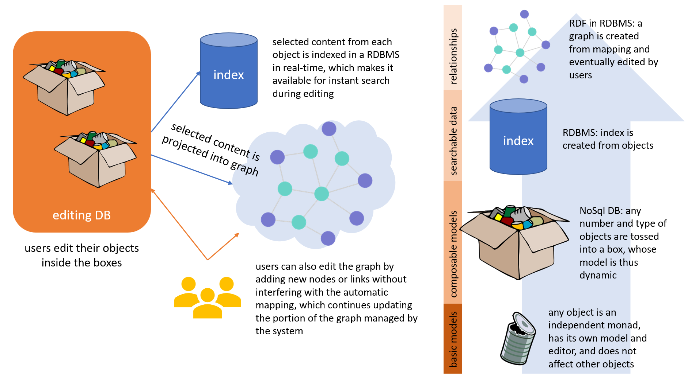

- 👉 [introduction](https://cadmus.fusi-soft.com/#/docs/semantic-graph)
- 🛠️ [code documentation](https://github.com/vedph/cadmus-graph/blob/master/docs/index.md)
- 💼 [Cadmus graph studio](https://cadmus-graph-studio.fusi-soft.com)

Cadmus semantic graph is a way of projecting data models into LOD entities and connecting them into a graph. In a sense, this represents a higher level of abstraction which can be added on top of data models.

The following picture summarizes the different layers of abstraction used in Cadmus: from bottom to top, we start from the monadic objects; group them into boxes thus building models by dynamic composition; index a subset of their properties using data pins; and eventually project another subset via mapping into an editable graph.

The mappings are stored in the RDBMS index database, but for easier definition you can list them in a JSON file, and then let Cadmus tool import them.

At any rate, given that they are a completely independent resource, this means that you can not only change or augment the projection behavior at any time; but you could even design a totally different mapping, using different ontologies from the same set of data. In a sense, the graph here is just another output of our objects (except that users can eventually edit it directly for supplying new details).

So, at the hearth of the graph is the _projection via mapping_. The mapping flow includes these main steps:

(1) a **source object** is provided to the mapper. This can be any type, but the current implementation relies on objects serialized into JSON. Usually, these come from MongoDB directly, so JSON is already at hand. Source object are items or parts (thesauri can be imported as nodes, but this does not happen via mapping as it's a single procedure, whatever the thesaurus). Anyway, ultimately from the point of view of the mapper any source object is just JSON code representing it.

(2) the mapper finds all the **[mappings](graph-mappings.md)** matching the source object, and applies each of them, collecting the results (nodes and triples) into a graph set.

(3) the graph set is **merged** into the graph store.

The graph store is implemented in a RDBMS, which is the same database used for indexing Cadmus data, which currently is a MySql database. The following picture summarizes its schema:

At the core of this schema there is the node (`node` table), which represents what in LOD are nodes and edges. A node is an entity. This entity can eventually represent a class (which can be the subclass of any other class: `node_class`), or can be used as a predicate (having some property-related metadata: `property`).

Every node is identified by a number, which is uniquely mapped to a shortened URI (via `uri_lookup`). A shortened URI is a URI shortened by an arbitrary (usually conventional) namespace prefix, like `rdf:type`. These prefixes are mapped to their corresponding resolved namespace (`namespace_lookup`). The other tables are used in the mapping process, which projects Cadmus part and item data into graph nodes.

- [graph mapping](graph-mappings.md)
- [graph walker](graph-walker.md)

🏠 [developer's home](../toc.md)

▶️ Next: [graph mappings](graph-mappings.md)
