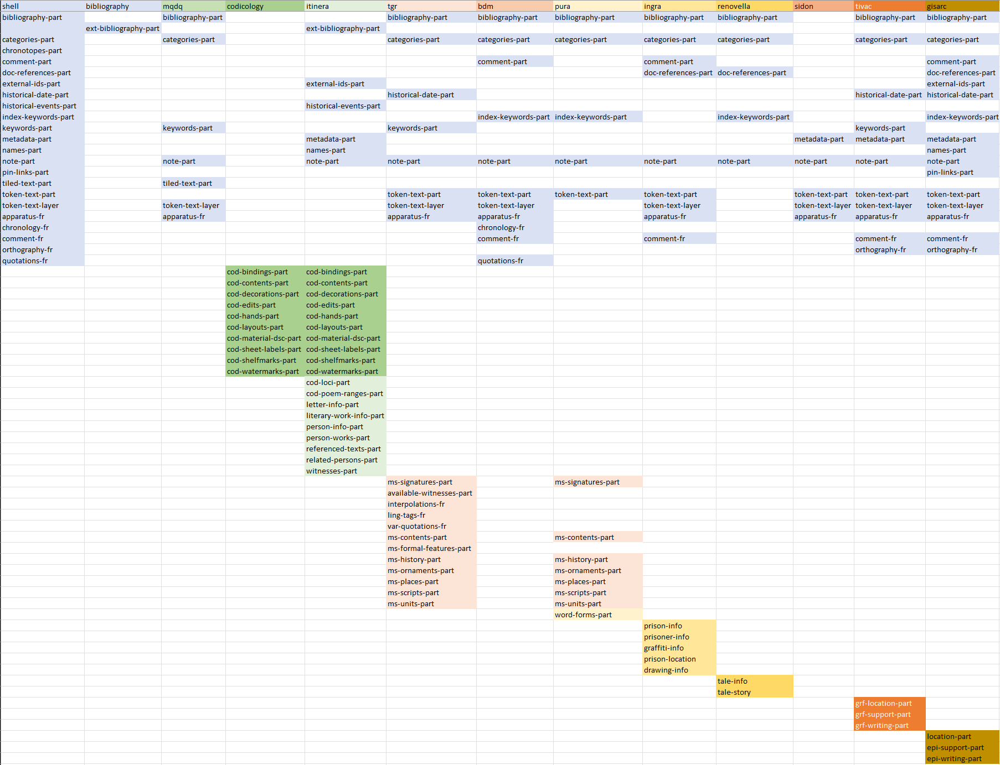

- [Production Sites](#production-sites)
- [Demos](#demos)
- [Repositories](#repositories)
  - [Itinera](#itinera)
  - [MapAeg](#mapaeg)
  - [Musisque Deoque](#musisque-deoque)
  - [PAGES](#pages)
  - [PURA](#pura)
  - [Re.Novella](#renovella)
  - [Vela](#vela)
  - [GISARC](#gisarc)
  - [Inquisitions Graffiti](#inquisitions-graffiti)
  - [Sidonius](#sidonius)

Here you can find a list of real-world projects using Cadmus. Most of them are founded by university research programs, either European (ERC) or Italian (PRIN), but Cadmus is also used to back the research of Marie Curie scholars and PhD students.

The picture below summarizes the usage of parts among different projects.

The top row lists the projects, while the columns list the parts and fragments. Whenever a part is reused in a project, it appears listed under its column. The background color of each part represents the project where it has been defined. As you can see, most shared parts come from Cadmus infrastructure (cyan background). You can look at a more dynamic visualization in the [Cadmus presentation page about models](https://cadmus.fusi-soft.com/#/models/graph).

## Production Sites

- [presentation](https://cadmus.fusi-soft.com/)
- [Itinera](http://itinera.unisi.it/)
- [PURA](https://6008.cophilab-cloud.ilc.cnr.it/)
- [PURA API](https://6009.cophilab-cloud.ilc.cnr.it/swagger/index.html)
- [Re.Novella](https://renovella.unisi.it/)
- [Re.Novella API](https://renovella.unisi.it:40393/swagger/index.html)
- [Sidon](https://cadmus-sidon.fusi-soft.com/)
- [Sidon API](https://cadmus-sidon-api.fusi-soft.com/)
- [Inquisition Graffiti](https://cadmus-ingra.fusi-soft.com/)
- [Inquisition Graffiti API](https://cadmus-ingra-api.fusi-soft.com/)
- [Inquisition Graffiti bibliographic API](https://cadmus-ingra-biblioapi.fusi-soft.com/)

## Demos

- [graph mapper](https://cadmus-graph-demo.fusi-soft.com/)

## Repositories

### Itinera

- [models](https://github.com/vedph/cadmus_itinera)
- [API](https://github.com/vedph/cadmus_itinera_api)
- [app](https://github.com/vedph/cadmus_itinera_app)

### MapAeg

MapAeg: Buondelmonti's Liber Insularum (B. Bessi, Università di Venezia Ca' Foscari).

- [API](https://github.com/vedph/cadmus_bdm_api)
- [app](https://github.com/vedph/cadmus-bdm-app)

### Musisque Deoque

- [Musisque Deoque API](https://github.com/vedph/cadmus_mqdq_api)
- [Musisque Deoque app](https://github.com/vedph/cadmus_mqdq_app)
- [conversion tool](https://github.com/vedph/mqdq_mqutil)

### PAGES

This is 4-projects solution:

- PAGES (Priscian’s Ars Grammatica in European Scriptoria: A Millennium of Latin and Greek Scholarship) (prof. M. Rosellini, Sapienza Università di Roma)
- The Transmission of Ancient Linguistics: Texts and Contexts of the Roman Grammatical Studies (prof. M. De Nonno, Università Roma Tre)
- Thesaurus dubii sermonis: Digital Critical Collection of Ancient Latin Linguistics (1st century BC – 8th century CE) (dr. E. Spangenberg Yanes, A. von Humboldt Stiftung – Bayerische Akademie der Wissenschaften)
- Thesaurus dubii sermonis: repertorio critico digitale della riflessione linguistica antica (I sec. a. C. – VIII sec. d. C.) (prof. M. Rosellini, Sapienza Università degli studi di Roma)

Repositories:

- [presentation](https://web.uniroma1.it/pages)
- [models](https://github.com/vedph/cadmus_tgr)
- [API](https://github.com/vedph/cadmus_tgr_api)
- [app](https://github.com/vedph/cadmus_tgr_app)
- [documentation](https://github.com/vedph/cadmus_tgr_doc)

### PURA

PURA: PURism in Antiquity (prof. O. Tribulato, Università di Venezia Ca' Foscari).

- [models](https://github.com/vedph/cadmus_pura)
- [API](https://github.com/vedph/cadmus_pura_api)
- [app](https://github.com/vedph/cadmus_pura_app)
- [documentation](https://github.com/vedph/cadmus_pura_doc)

### Re.Novella

Re.Novella: Il genere novella nel Rinascimento italiano: repertorio, database e inquadramento storiografico (prof. M. Marchi, Università di Siena).

- [models](https://github.com/vedph/cadmus-renovella)
- [API](https://github.com/vedph/cadmus-renovella-api)
- [app](https://github.com/vedph/cadmus-renovella-app)

### Vela

- [API](https://github.com/vedph/cadmus-vela-api)
- [app](https://github.com/vedph/cadmus-vela-app)

### GISARC

Marie Curie GISARC (L. Tagliapietra, Università di Venezia Ca' Foscari).

- [models](https://github.com/vedph/cadmus-gisarc)
- [API](https://github.com/vedph/cadmus-gisarc-api)
- [app](https://github.com/vedph/cadmus-gisarc-app)

### Inquisitions Graffiti

PhD Inquisitions Graffiti (A.C. Basilicò, Università di Venezia Ca' Foscari).

- [models](https://github.com/vedph/cadmus_ingra)
- [API](https://github.com/vedph/cadmus_ingra_api)
- [app](https://github.com/vedph/cadmus_ingra_app)

### Sidonius

PhD Sidonius Apollinaris critical edition (E. Recupero Porcino, Università di Venezia Ca' Foscari).

- [API](https://github.com/vedph/cadmus-sidon-api)
- [app](https://github.com/vedph/cadmus-sidon-app)
