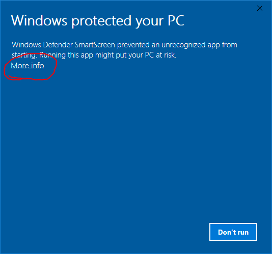

🔗 [direct download](../downloads/khronos.zip)

- platform: Windows

Khronos is a dummy minimalist Windows WPF application I wrote in a hurry a lot of years ago, to assist me in keeping up the speech time during a conference. In one of these conferences, the audience asked me this app, so here it is.

## Installation

Khronos is an old WPF application. To run it, you need Microsoft NET 4.8. The setup should install it automatically if not already present. Otherwise, just download the package manually from here and install it.

On Windows 10, you will probably get a protection warning, like the one depicted below:

During install, you will probably get a protection warning, like the one depicted below:

This warning is issued whenever the program being installed is not widely used, and thus not known to the protection system. Just discard it by clicking on `More info` and then clicking `Run Anyway`. Then proceed with the usual setup, clicking the Next button until finished.

## Usage

The application is designed to have a minimal impact on the screen, so it just shows a countdown timer in a small, transparent window, so you can still see what's behind it. The picture above shows it on a black desktop with an icon. You can move the application to a corner of your screen, and launch your presentation, so you can keep an eye on your time, without being distracted.

An essential set of options allows you to set the timer, together with other visual features:

- seconds: check this to show seconds in the timer.
- timer: check this to show the timer digits.
- bar: check this to show the timer progress bar. This changes color as time passes.
- sound: a sound file to be played when time is out. Use the play button to hear it.
- repeat: the number of times you want the sound file to be played.

Keyboard shortcuts:

- start: F2
- stop: F3
- reset: F4
- settings: F1
