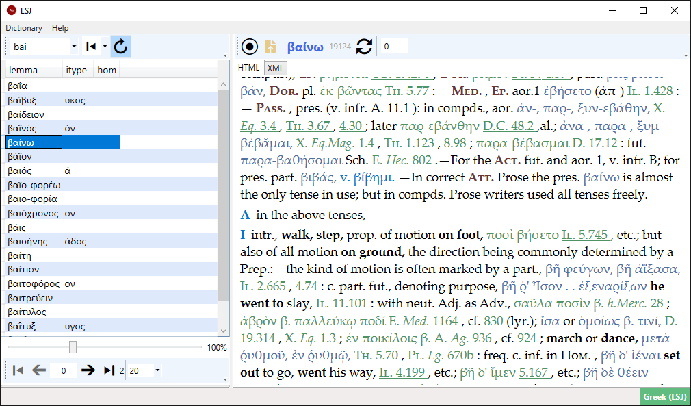
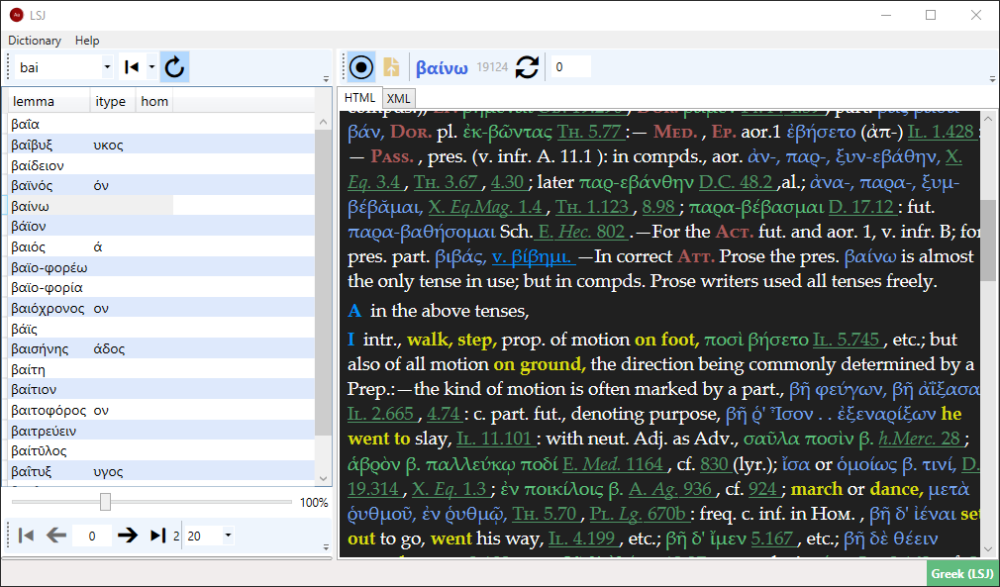
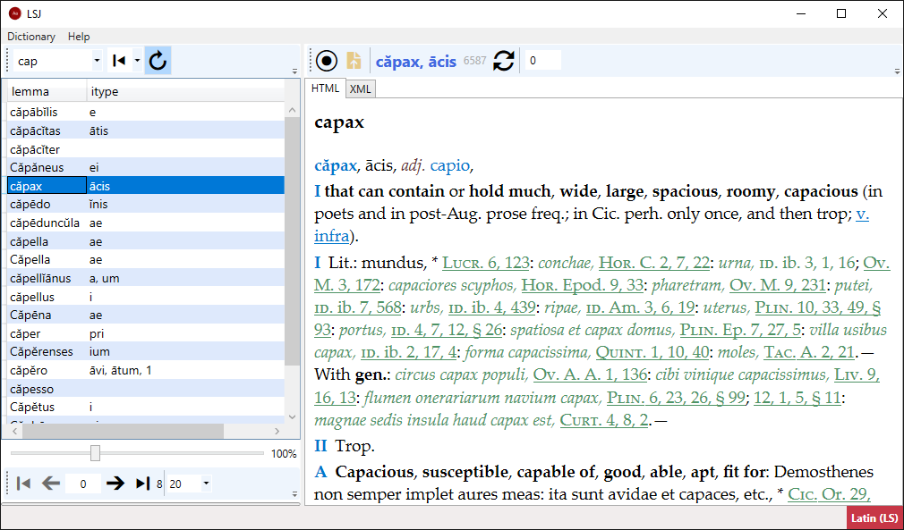

🔗 [direct download](http://www.fusisoft.it/downloads/lsj-lite.zip)

- platform: Windows

Text provided by Perseus Digital Library, with funding from The National Endowment for the Humanities. Original version available for viewing and download at [http://www.perseus.tufts.edu](http://www.perseus.tufts.edu).

LSJ Lite is an old, minimalist application created to browse the Greek LSJ ([Liddell-Scott-Jones](https://en.wikipedia.org/wiki/A_Greek%E2%80%93English_Lexicon)) and Latin LS ([Lewis-Short](https://en.wikipedia.org/wiki/A_Latin_Dictionary</a>)) dictionaries I converted from [Beta code](https://en.wikipedia.org/wiki/Beta_Code) from the [Perseus Digital Library](http://www.perseus.tufts.edu/hopper/). As such, it provides only quick lookup capabilities: you can locate lemmata by any portion of their text (starting with a text, ending with a text, or just containing it anywhere), of course discarding non-relevant traits (diacritics, casing, etc.), and type Greek either in Unicode or in Beta code.

I created this application for personal use, so this should be regarded as an alpha release, including only the minimal set of functions I was happy with at that time. Of course, I could add more search functions and platforms (web, mobile, etc.), but this is not a priority.

I converted the original [XML-TEI](https://en.wikipedia.org/wiki/Text_Encoding_Initiative) text from Perseus Beta code to [Unicode](https://home.unicode.org/), using my [Proteus](../proteus.md) conversion system, preprocessed, and archived into a database. This allows for powerful and reasonably fast searches, and makes it possible to use these dictionaries in an offline environment, thus providing the convenience of having these two great dictionaries always at your fingertips. Offline usage is the main reason for choosing a desktop platform. Among the available Windows flavors, the current application was developed with WPF 3, to make the distribution easier in a limited environment, outside the Marketplace.

👉 As this application relies on an older WPF-based platform, you might prefer to use a more recent, web-based UI for online usage is available at my [demo server](https://lsj.fusi-soft.com).

## Usage

To **lookup a word**, just type the initial part of it in the search box. To quickly move the cursor to the search box you can press F2.

As you type, the paged list of matching lemmata is updated in real-time. When you see the word you are looking for, stop typing and click it to read its text. If there is only a single match, the corresponding text is automatically opened, thus saving you a click (click the curved-arrow button to disable this behavior).

You can browse the results pages by using the controls at the bottom of the lemmata list. By default, each page contains 20 items, but you can change this value, too.

You can **change the matching criteria** by selecting a different mode in the drop-down to the right of the search box. By default it shows a left arrow, meaning that we want to match the initial part of the word. Pick another option to match either any part of it, or its end.

The lemma's text is presented in a typographically pleasant form in the **HTML tab**. This is the result of a real-time [XSLT](https://en.wikipedia.org/wiki/XSLT)-based transformation. The corresponding [XML](https://en.wikipedia.org/wiki/XML) source code is available in the **XML tab**.

Currently there are two **presentation themes** for the transformed text: light and dark. The light type is the default. The dark type is designed to save your eyes; it has a black background, and changes other colors accordingly. You can cycle through the available themes with the circle button.

This figure shows the dark theme for the text:

If you want to provide your own transformation, thus defining your custom theme, you can load it from an XSLT file, and then cycle through the available themes until you get to it.

### Typing Greek

To type Greek words during lookup, you have two options:

- type with **(Unicode) Greek**, using e.g. the Greek keyboard layouts built in the Windows OS. You do not need to add diacritics, as the lookup ignores them and is case-insensitive. Anyway a word with diacritics will do no harm, as the application will discard them.
- type using the Latin-based characters, according to the **Beta code** conventions. This has the advantage of not requiring you to switch to the Greek keyboard before typing. You just have to remember the Beta code letters, which for convenience are listed below.

Here is the Greek alphabet in Beta code:

- α = `a`
- β = `b`
- γ = `g`
- δ = `d`
- ε = `e`
- ϝ = `v`
- ζ = `z`
- η = `h`
- θ = `q`
- ι = `i`
- κ = `k`
- λ = `l`
- μ = `m`
- ν = `n`
- ξ = `c`
- ο = `o`
- π = `p`
- ρ = `r`
- σ = `s`
- τ = `t`
- υ = `u`
- φ = `f`
- χ = `x`
- ψ = `y`
- ω = `w`

You do not need to explicitly pick an input method: just start typing, and the application will adapt and use the right one.

### Looking Up Citations

This is currently an experimental feature, as I inferred most query parameters empirically from the [Perseids service](http://cts.perseids.org). When you click on a citation hyperlink, the service is used to open the corresponding text.

If you want to read a larger text span, just enter the number of textual units to be included before and after the targeted unit. For instance, if the citation is _Iliad_ 12.100 and you provide a span value of 3, lines 97-103 will be included in the citation text.

### Changing Dictionary

To change the currently used dictionary, use the `Dictionary` menu. The current dictionary is shown in the bottom-right corner of the application. All the application's functions are the same for both dictionaries.

This figure shows the Latin dictionary:

