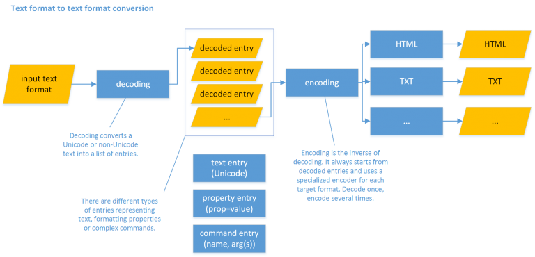

👀 [Proteus Demo](http://proteus.fusi-soft.com/)

As we have seen, the universal text format converter discussed here uses the text encoding conversion subsystem when the format being handled also implies a different (often proprietary or legacy) text encoding. Of course, it may well happen that this is not required, as the text encoding is already the desired one; but in any case, the format conversion system has the capability of incorporating the encoding conversion system, just like rich text (=text enriched with formatting, for instance the RTF format) is a superset of plain text (the raw sequence of characters, encoded according to a specific encoding).

The encoding converter does not directly map encoding A to encoding B, but describes both of them independently, and then just finds the largest common subset between those descriptions; in a similar way, the format converter does not rely on a direct conversion from format A to format B; rather, it uses an intermediate abstract level describing the text with the source format, and then converts this description into the target format.

In other terms, in converting from format A to B there are two main steps:

1. decoding format A into a more abstract description (let’s call this X);
2. encoding X into B.

This way, the decoding process is separated from the encoding, which means that we do not have to reimplement it whenever we convert A to something else; we create a decoder from A to X once, and then use it for any conversion involving A, either as a source (e.g. A to B) or as a target (e.g. B to A).

This descriptive model (X) consists in a sequence of entries as variously decoded from the source format. The entries belong to any of these 3 types:

- text entries: entries representing the character(s) of a text.
- property entries: entries representing formatting properties typically applied with an on/off model, like bold or italic.
- command entries: all the other metatextual entries, whatever their complexity and meaning.

Essentially, we distinguish entries representing text from entries representing metatextual data; the difference between property and command entries can eventually fade out, but usually it facilitates handling the status of binary formatting properties throughout the text being decoded.

Any input text is decoded into a sequence of decoded entries (representing converted text, or metatextual data), and then these are used as the input to the encoders. This allows decoding only once into a common, shared model, and then use any number of encoders for any output format. For instance, you may have a decoder for Beta code which just emits decoded entries; you can then have an encoder for HTML, another for XML-TEI, another for RTF, another for plain text, etc. Should you want to add a new format, you just add an encoder, which consumes the entries coming from whatever source format you decoded.

Typically, a document decoder can leverage a number of modular components to do its job, like:

- any number of chained text filters, which transform the input text before conversion, preparing it for the decoder.
- any number of text encoding converters, each for a specific text encoding. In legacy, proprietary texts it is often the case that even in the same work several different encodings are used. For instance, in a dictionary you might have a specific encoding to represent IPA characters for the pronunciation of a word, or another one to represent Greek instead of Latin characters. This often happens because legacy text encodings were limited in their bit size, so that most proprietary encodings use 8-bits i.e. allow a maximum of 256 different characters. When these are exhausted, another additional encoding kicks in. This is no more the case with modern encodings like [Unicode](http://www.unicode.org/), with its 21 bits allowing millions of characters, but was a relevant limitation when legacy digital content was created.
- any number of escape decoders, to decode all the metatextual content represented by special sequences of characters. An escape is any sequence of character(s) having a special metatextual meaning in the text to be converted. For instance, in Beta code the sequence `$1` does not represent a dollar and a digit 1, but rather it tells the software processor (or the human reader) that all the characters following it are to be intended as Greek. Often, legacy encodings make a wide use of such escapes to represent metatextual data in the text, especially for formatting purposes. Whatever their nature, they ultimately get decoded into entries (textual or metatextual entries, or a combination of both). In this system, in most cases escapes can be defined declaratively and used by configurable components.

Thus, a decoder starts with a string using some special text encoding and escapes, and decodes it into a list of entries, in the sense defined above. These entries are then used by encoders to build an encoded text in some format.

Once we have the list of entries, we can build any output format from it (e.g. HTML, XML, RTF, TXT, etc.). To this end we use an encoder component, which receives the list of entries and generates the required format.

There can be several different approaches for implementing document encoders. In the simplest cases we can just read the entries and produce an output; in more complex scenarios instead, a typical approach is “region”-based.

A region-based encoder uses a set of region detector components to group the input entries into “regions”, each delimiting a specific ranges of entries. Then, the regions information combined with the decoded entries can be variously used to build the encoded output. This approach is typically used when are converting between systems of different nature: for instance, when converting from a typographical markup system to a semantic markup system. In this case, detecting regions relies on formatting, content, position and similar hints in the source document, and represents its interpretation in semantic terms.

For instance, when converting a dictionary item where lemmata are bold and red, etymologies are inside square brackets, definitions are italic, etc. you might want to add region detectors for each of these semantically-defined regions of the text. Each of these detectors would rely on a combination of entries to determine where each region begins and ends, thus delimiting the input text. Then, each of these regions would typically be processed by an independent region encoder, which takes the entries delimited as representing a specific region and convert them into the output format. Of course, such regions can freely be nested (e.g. an usage region in a dictionary can be embedded into a definition).

This does not imply that every entry should be included in a region, but only states that when an entry is included in some specific region(s), it will be encoded in a way which differs from the default one. For instance, a block of literary text could be encoded as a verse or a paragraph, according to whether its entries appear in a poetry region or not. When an entry is outside any regions, the conversion just uses the default encoder; else, it tries with the encoder specialized for each of the regions, from the nearest to the farthest region embracing the entry.

Thanks to this approach, we can keep the task of detecting the different semantic regions of a document distinct from the task of encoding each of these regions into a specific output. Thus, the same detectors can be reused, whatever output we want to build in our conversion.

The regions-based approach is widely used to convert complex texts like dictionaries, where each entry has several areas inside it, often hierarchically structured; for instance, an entry includes orthography, syllabification, pronunciation, etymology, groups of senses, links to other words, etc.; each sense includes definitions, examples, translations, usage hints, etc., and so forth. In legacy digital formats, there is no explicit markup for such semantic areas, so that the corresponding regions must be detected with complex procedures, relying on typographical formatting, text content, and its relative position. Of course, the typographical formatting is often a consequence of the semantic structure of the text, but in no way it corresponds to it without ambiguities. In fact, formatting happens to provide either too few data (as e.g. the same attribute is applied to different semantic areas: maybe italic is used for definitions, usages, pronunciations, etc.), or too much. The latter case often adds even more noise to the detection process, as formatting is redundantly used for aesthetic purposes. For instance, say we want to print or display a comma without italic inside an otherwise italic portion of text like a definition; in this case, the semantically unique definition would be split into two halves by the occurrence of any punctuation character, just because the legacy encoding switches from non-italic to italic and vice-versa, whereas semantically the whole text is a unit as such.

Whatever the scenario, the encoding process can finally leverage also a set of chained filters, at both its ends: entry filters at its start (to filter the list of decoded entries in any useful way), and text filters at its end (to adjust the encoders’ output in any useful way). Thus, a highly composable and modular system provides several occasions for reuse, reducing the effort of converting several different legacy texts.

Also, the conversion flows from its input to its output by passing a number of steps, where each can be tested and verified before proceeding to the next one. This helps detecting issues or providing refinements.

In fact, as a final remark in this very short sketch, it must be emphasized that the conversion system used here is highly modular and composable right because it can be built in several, successive steps. Often, when facing the task of converting complex legacy texts in proprietary formats, which have poor or not existing documentation at all, we must opt for a more empirical approach, starting from an idea of it, which is then progressively refined during the conversion process itself. For instance, we can start with a set of decoded entries, and then start inspecting them to find out which regions can be detected inside it, and how. Whenever we add a new region detector and its corresponding encoder, we can re-run the whole conversion process and get more and more refined results. When we finish adding all the detectors, encoders, and filters eventually required, we get the desired output. But at any stage, starting from the very first conversion, we can immediately get a full output and inspect it to gain more and more information about the format being converted. This kind of conversion is not a monolithic procedure, but rather an aggregation of more and more components, until we get the desired output.

This way, we can effectively recover a big quantity of legacy digital resources (or even paper resources, digitized with OCR software), encoding them into more semantic and structured output, which makes them much more usable and fit to modern usages.

Also, another creative use case of this system is parallel to the one seen for typing in Greek: in fact, a subsystem of it can be used to ease the composition and markup of XML-based texts, without having the users enter a single tag. I call this kind of aided editing Visimark.
