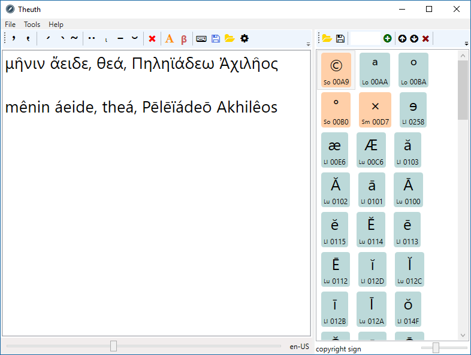
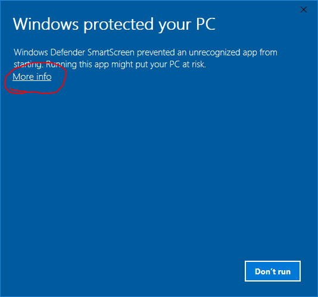
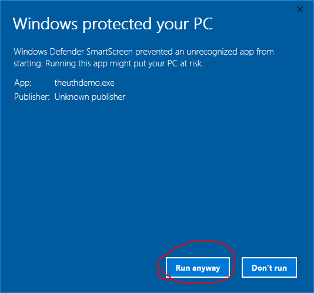
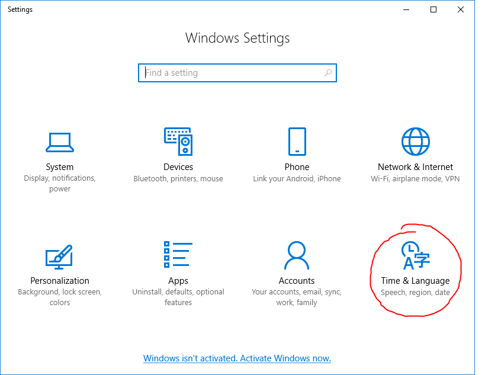
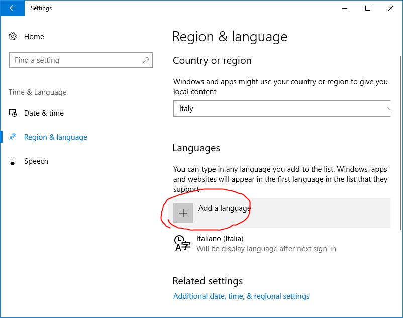
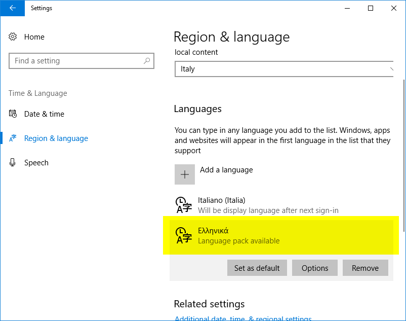
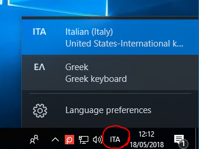

🔗 [direct download](../downloads/theuth-demo.zip)

- platform: Windows

This program will install a demo of the Theuth Greek writing system, whose purpose is showing how my generic [Proteus](../proteus.md) text converter framework can be creatively used also in assisting during text composition.

Some friends of mine use this tiny app to quickly and easily write some Greek text, have it automatically transliterated, or convert [Beta coded Greek text](https://en.wikipedia.org/wiki/Beta_Code) to [Unicode](http://www.unicode.org).

This is an old .NET software; to run this program, you need Microsoft NET 4.8. The setup should install it automatically if not already present. Otherwise, just download the package manually from here and install it.

During install, you will probably get a protection warning, like the one depicted below:

This warning is issued whenever the program being installed is not widely used, and thus not known to the protection system. Just discard it by clicking on `More info`:

Then proceed with the usual setup, clicking the Next button until finished.

## Configuring Windows for Greek

Once the program is installed, you should ensure you have configured your Windows to support the Greek language. Should not this be the case, just open settings and select Time and Language:

Then click the Add language button, and choose Greek in the list of available languages (you can easily filter the list by typing "Greek"):

Now the Greek language appears in the available languages:

At this point, you should see the active keyboard layout indicator in your taskbar, like in this screenshot:

To select the Greek layout you can click the indicator and select it, or press the Windows button + spacebar. In the program, you can just press Ctrl+1 to type with your Latin-based keyboard, or Ctrl+2 to type with your Greek-based keyboard.

## Usage

This is just a demo, not a full writing or conversion app. Its only purpose is demonstrating some additional usages of my text conversion framework. Here, typing polytonic Greek text is the byproduct of converting from Unicode plain text to Unicode plain text, by adding or removing diacritics from source to target. Other conversions samples are provided by Greek transliteration and Beta code (the full Beta converter handles rich text, but this demo is limited to plain text).

- type in Greek using your favorite Windows keyboard layout. You can activate the Greek layout by pressing CTRL+2, and the Latin layout by pressing CTRL+1. Please note that those layouts are defined in the Settings menu using the corresponding standard culture name. The default value for Greek is "el-GR", and usually this should be the right one. As for Latin, you might want to change it to fit your keyboard (e.g. set to "it-IT"), because the default value refers to the US keyboard ("en-US").
- to toggle any diacritic, place the cursor after the target character and press the corresponding button or the shortcut key for it. Each diacritic is added if absent, or removed if present. Incompatible diacritics are automatically removed (e.g. an acute accent removes a circumflex, or a smooth breathing removes a rough breathing). A command is available also to remove all the diacritics at once. Diacritics can be edited both for Greek and Latin letters.
- to transliterate the selected Greek text, placing the result in the clipboard, use the A button.
- to convert the selected text from Beta code into plain text, placing the result in the clipboard, use the Beta button. Note that if you are converting Greek, you should prefix it with any valid `$` escape (e.g. `$MH=NIN A)/EIDE, QEA/, *PHLHI+A/DEW *)AXILH=OS`). In the options dialog, you can customize some aspects of the converter, especially to enable the "lax" Beta code usage found in several documents, e.g. in the Perseus Digital Library LSJ. In this mode, you can use uppercase and lowercase Greek letters, and `^` and `_` as diacritics or symbols (according to their context), representing short and long marks or symbols.
- to see or change the default keyboard shortcuts click the keyboard icon button.
- to insert special or favorite characters, use the picker at the right. You can customize this picker in several ways.

The full profile for the application (keyboard layouts and shortcuts) is automatically saved on exit and restored on launch. You can also manually save/restore keyboard shortcuts to/from files. Uncheck the corresponding option in the Tools menu when you do not want to save the profile on exit (maybe you're just experimenting with new shortcuts and don't want to persist them).

## Note for Italian Users

I often get requests about customizing this demo for an Italian keyboard layout. Should this be your case, follow these instructions:

1. ensure you have downloaded the latest version of the program.
2. once installed, launch the program and click Load keybindings from file (the yellow folder icon next to the keyboard icon). Select the file with the Italian keyboard bindings, which is located under the program Assets folder, and named `it-IT.thkb`. This defines the keyboard bindings for the Italian keyboard layout. The same folder also contains the predefined keyboard bindings for the US English keyboard layout (the default bindings).
3. click the Settings button (gear icon) and under `Editor/Latin` set the keyboard code to `it-IT`, then click OK. This tells the program to switch to the Italian keyboard layout when clicking Ctrl + `1`.

Of course, you can change the keyboard bindings as you prefer at any time. This is only a quick way to start typing with an Italian keyboard layout.

The predefined bindings are as follows:

- activate Latin = Ctrl + `1`
- activate Greek = Ctrl + `2`
- remove all diacritics = Ctrl + space
- toggle rough breathing = Ctrl + `(`
- toggle smooth breathing = Ctrl + `)`
- toggle acute accent = Ctrl + `/`
- toggle grave accent = Ctrl + `\`
- toggle circumflex accent = Ctrl `+` = or Ctrl + `^`
- toggle breve = Ctrl + `B`
- toggle macron = Ctrl + `L`
- toggle dieresis = Ctrl + `%` or Ctrl + `:`
- toggle iota = Ctrl + `I`
